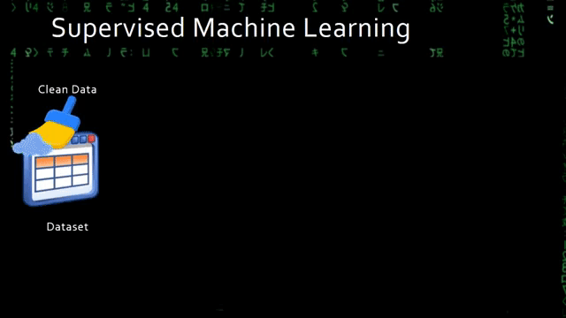

```{css}
.shiny-output-area {
  margin: 0;
}

.full-width-image {
    width: 100vw; /* Define a largura igual à largura da janela do navegador */
    height: auto; /* Mantém a proporção original da imagem */
}
```

```{r setup, include=FALSE}
options(shiny.autoreload = TRUE)
options(gargle_oob_default = TRUE)
library(flexdashboard)
library(dplyr)
library(fontawesome)
library(leaflet.extras)
library(reactable)
library(mapview)
library(stringr)
library(leaflet)
library(visdat)
library(shinyWidgets)
library(explore)
library(plotly)
library(vroom)
library(xml2)
library(rvest)
library(cepR)
library(abjutils)
library(wordcloud)
library(RColorBrewer)

token <- "33efdb7230265c63c301ced1bc16370b"
cep <- function(
    endereco = "joao-pessoa,rua-francisco-cavalcan, joao pessoa, paraiba, brasil"){
  
  padronizando_string <- function(x){
    stringr::str_split(string = abjutils::rm_accent(tolower(x)),
                       pattern = "\\s+")[[1L]] |> paste0(collapse = "-")
  }

  url <- glue::glue(
    "http://cep.la/{padronizando_string(x = endereco)}"
  ) |> httr::GET()
  
  url <- xml2::read_html(url)

  rvest::html_table(url)[[1L]][1,][[1L]] |> 
    stringr::str_replace("-", "") |> 
    cepR::busca_cep(token = token)
}

mapa <- function(df = NULL, imovel = NULL){

  if(is.null(df)){
    m <- data.frame(nome = "TecGeo", latitude = -7.1214628, longitude = -34.8655664) |> 
      sf::st_as_sf(coords=c("longitude", "latitude"), crs = 4326) |> 
      mapview::mapview()
    
    m <- leafem::addLogo(m, "https://tecnologiageo.com.br/static/images/logo_tecgeo2.png",
                    position = "bottomleft",
                    offset.x = 50,
                    offset.y = 250,
                    width = 180,
                    height = 100)
    return(m)
  }
  
  dados <- 
    df |> 
    sf::st_as_sf(coords=c("longitude", "latitude"), crs = 4326)
  
  if(!is.null(imovel)){
    dados <- 
      dados |> 
      dplyr::filter(tipo == imovel) |> 
      dplyr::select(-url, -z_lat, -z_lon) |> 
      dplyr::mutate(metro_quadrado = valor/area)
    
    intervalos <- lattice::do.breaks(c(0, 20000), 12L)
    
    mapa <- dados |> 
      mapview::mapview(
        alpha = 1,
        zcol = "metro_quadrado",
        col.regions=brewer.pal(length(intervalos), "Paired"),
        at = intervalos,
        layer.name = "Valor do metro quadrado"
      )
  } else {
    mapa <- 
      dados |> 
      dplyr::filter(tipo == imovel) |> 
      mapview::mapview(alpha = 1)
  }
  
  leafem::addLogo(mapa, "https://tecnologiageo.com.br/static/images/logo_tecgeo2.png",
                       position = "bottomleft",
                       offset.x = 50,
                       offset.y = 250,
                       width = 180,
                       height = 100)
}

mapa_palavras <- function(df, imovel = NULL, espectro = "metro_quadrado"){
  
  df <- 
      df |>
      mutate(metro_quadrado = valor/area)

  
  if (!is.null(imovel) && length(imovel) == 1L) {
    freq <-
      df |>
      group_by(bairro) |>
      dplyr::filter(tipo == imovel) |>
      summarise(n = n(), media = mean(metro_quadrado))
  } else {
     freq <-
      df |>
      group_by(bairro) |>
      summarise(n = n(), media = mean(metro_quadrado))
  }
  
  if(espectro == "metro_quadrado")
    valores <- freq$media
  else
    valores <- freq$n
  
  par(bg = "black")
  wordcloud(
    freq$bairro ,
    valores,
    col = terrain.colors(length(freq$bairro) , alpha = 0.9) ,
    rot.per = 0.3)
}
```

# Sobre {data-icon="fa-home"}

```{r, fig.height=10, fig.align='center'}
img(src = "img/principal.png",  class = "full-width-image")
```

## Row {data-width="full"}

```{r fig.width=1}

```

Essa aplicação está sendo desenvolvida com a linguagem de programação [**R**](https://www.r-project.org/) e tem como objetivo evoluir para uma aplicação completa com recursos de visualização, descrição, modelagem e emissão de relatório automatizado de um imóvel, com base em algumas de suas características, levando em conta dados reais obtidos via [**web scraping**](https://en.wikipedia.org/wiki/Web_scraping) que são utilizados para o treinameto de um modelo de [**machine learning**](https://en.wikipedia.org/wiki/Machine_learning).

O modelo, que encontra-se em constante aprendizado, tem como objetivo estimar o valor do metro quadrado - $m^2$ com base em diversas caracrística do imóvel anunciado, sendo a sua geolocalização a principal característica. Entre outras características consideradas, pode-se citar a área, tipo do imóvel (apartamentos, casas, terrenos e flats), número de quartos, numero de banheiros, número de vagas de garagem, sendo essas variáveis numéricas. Também são consideras diversas outras dicotômicas (variáveis booleanas), que informa ao modelo a existência ou não de uma determinada característica no imóvel, como por exemplo, a existência ou não de elevador, piscina, salão de festa, academia, área de serviço, espaço gourmet, salão de festa, portaria, sauna, quadra poliesportiva, entre outras.

**Algumas observação**:

1 - Essa aplicação está em constante evolução;

2 - Alguns recursos disponíveis serão de maior interesse para quem está fazendo a modelagem e eventualmente poderão não fazer parte da aplicação final;

3 - Essa aplicação tem como objetivo utilizar a maior quantidade de recursos open source possíveis, visando confiabilidade e barateamento.

# Construir mapa pelo CSV {data-navmenu="Ferramentas" data-icon="fa-map-location-dot"}

## Column {.sidebar}

```{r}
pickerInput(
    inputId = "tipoimovel",
    label = "Tipo de Imóvel",
    choices = c("casas", "apartamentos", "flat", "terrenos"),
    selected = c("casas", "apartamentos", "flat", "terrenos"),
    multiple = TRUE
  )
```

## Row {data-width=10000}

### `r fa("file-csv", fill = "darkblack")` Após o carregamento do CSV, aguarde até a renderização do mapa

```{r   eval=require('leaflet'), echo = FALSE}
library(spsComps)
options(shiny.maxRequestSize=700*1024^2)

dataset <- reactiveVal(NA)  # ReactiveVal para armazenar o conjunto de dados

renomeando_tipos <- function(x)
    stringr::str_split(x, "_")[[1L]][1L]

observeEvent(input$arquivo, {
  data <- vroom::vroom(input$arquivo$datapath, show_col_types = FALSE)
  tipos <- purrr::map_chr(.x = data$tipo, .f = renomeando_tipos)
  data$tipo <- tipos
  dataset(data)  # Atualizar o reactiveVal com o novo conjunto de dados
})

fileInput(
  "arquivo",
  "",
  buttonLabel = "Procure o CSV",
  placeholder = "Nenhum arquivo selecionado",
  accept = ".csv",
  width = '100%'
)

renderLeaflet({
  tryCatch(
    {
      req(dataset())
      mapa(df = dataset(), imovel = input$tipoimovel)
      
    }, error = function(e){
       mapa(df = NULL)
    }
  )})
```

## Column {.tabset .tabset-fade data-width=10000}
----------------------------------------------

### `r fa("table", fill = "darkblack")`

```{r}
  renderReactable({
  req(dataset())
  dados <- dataset() |> 
    dplyr::select(bairro, valor, area) |> 
    group_by(bairro) |> 
    summarise(valor_mediano = round(median(valor), 2L), valor_mediano_m2 = round(median(valor) / median(area), 2L), total = n())
  
  tab <- reactable(
    dados,
    filterable = TRUE,
    defaultPageSize = 15L,
    columns = list(
        valor_mediano_m2 = colDef(
          style = function(value) {
            color <- ifelse(log(value) > median(log(dados$valor_mediano_m2)), "#f1625c", "#5cf1b4")
            list(background = color)
          }
        )
      )
  )
  tab
})
```

### `r fa("binoculars", fill = "darkblack")`

```{r}
renderPlot({
  req(dataset())
  
  if(is.null(input$tipoimovel)){
    plot.new()
  }else {
    dados <- dataset() |> dplyr::filter(tipo == input$tipoimovel)
    visdat::vis_dat(dados)
  }})
```

### `r fa("chart-area", fill = "darkblack")`

```{r}
renderPlotly(
  {
    req(dataset())
    dados <- 
      dataset() |> 
      dplyr::mutate(valor_m2 = valor/area)
    explore::explore_density(dados, valor_m2 , target = tipo) |>
      plotly::ggplotly()
  }
)
```

### `r fa("file-word", fill = "darkblack")`

```{r}
pickerInput(
    inputId = "espectro",
    label = "",
    choices = c("Pelo Valor do Metro Quadrado", "Pelo Número de Observações"),
    selected = c("metro_quadrado", "observacoes"),
    multiple = FALSE
  )

renderPlot({
  req(dataset())
  mapa_palavras(df = dataset(), imovel = input$tipoimovel, espectro = input$espectro)
})
```

## Row

# Buscar coordenadas e CEP pelo endereço {data-navmenu="Ferramentas" data-icon="fa-magnifying-glass"}

```{r}
textInput(inputId = "endereco", label = "Informe o Endereço", value = "Av. Juarez Távora, 522 - Torre, Empresarial Maximum, Sala 608. João Pessoa, PB - Brasil, CEP - 58040-020", width = NULL,
  placeholder = NULL)

tabela <- reactiveVal(NA)  # ReactiveVal para armazenar o conjunto de dados

observeEvent(input$endereco, {
  m <- cep(input$endereco)
  tabela(m) # Atualizar o reactiveVal com o novo conjunto de dados
})

### Teste
renderTable({
  tryCatch(
    {
      tabela <- tabela()
      tabela$latitude <- formatC(tabela$latitude, format = "f", digits = 15L)
      tabela$longitude <- formatC(tabela$longitude, format = "f", digits = 15L)
      tabela
    }, error = function(e){
      tabela <- cep("Av. Juarez Távora, 522 - Torre, Empresarial Maximum, Sala 608. João Pessoa, PB - Brasil, CEP - 58040-020")
      tabela$latitude <- formatC(tabela$latitude, format = "f", digits = 15L)
      tabela$longitude <- formatC(tabela$longitude, format = "f", digits = 15L)
      tabela
    }
  )
})
```

### Endereço no mapa

```{r}
renderLeaflet({
    tryCatch(
    {
      req(tabela())
      m <- tabela() |>  
      sf::st_as_sf(coords=c("longitude", "latitude"), crs = 4326) |> 
      mapview::mapview(legend = FALSE)
      m@map
    }, error = function(e){
      m <- data.frame(nome = "TecGeo", latitude = -7.1214628, longitude = -34.8655664) |> 
        sf::st_as_sf(coords=c("longitude", "latitude"), crs = 4326) |> 
        mapview::mapview(legend = FALSE)
      m@map
    })
})
```

# Contatos {data-navmenu="Ajuda" data-icon="fa-phone-volume"}

## Row {data-width="full"}

```{r fig.width=3}

```

#### Empresa

<br>

Há mais de 17 anos no mercado, a Tecgeo é uma empresa que oferece serviços de geoprocessamento e tecnologia da informação para todo o Brasil. Somos especialistas no desenvolvimento de diversas soluções que utilizam tecnologia e informação geoespacial para a Gestão da Informação Inteligente em empresas públicas e privadas. 

<br>

#### Contatos 

<br>

- `r fa("envelope-open-text", fill = "darkblack")` contato@tecnologiageo.com.br

- `r fa("phone-volume", fill = "darkblack")` +55 (83) 3244-7755 

- `r fa("map-location-dot", fill = "darkblack")` Av. Juarez Távora, 522 - Torre, Empresarial Maximum, Sala 608. João Pessoa, PB - Brasil, CEP - 58040-020 

# Informações {data-navmenu="Ajuda" data-icon="fa-info"}

#### Informações gerais e materiais

<br>

```{r fig.width=5}

```

<br>

A aprendizagem de máquina é um campo da inteligência artificial que se concentra no desenvolvimento de algoritmos e técnicas que permitem que os sistemas computacionais aprendam e melhorem automaticamente a partir dos dados. Ela envolve o uso de modelos estatísticos e algoritmos para capacitar os computadores a identificar padrões, tomar decisões e realizar tarefas específicas sem serem explicitamente programados para cada passo.

Essa aplicação faz uso de técnicas estatísticas e utiliza-se de algoritmos de aprenziagem de máquina para a previsão do valor do metro quadrado de imóveis de uma dada região geográficas. O algoritmo é treinado periodicamente com dados reais de anuncios de imóveis, cujos os dados são obtidos por meio de web scraping, que trata-se de raspagem de dados de sites de anuncios imobiliários.

<br>

```{r fig.width=6, fig.align='center'}

```

<br>

A animação acima demonstra o procedimento de treinamento de um modelo supervisionado de aprendizagem de máquina, partindo do tratamento e limpeza dos dados que posteriormente é divido em conjunto de treinamento e teste, em que sob o conjunto de treinamento o modelo será treinado, isto é, serão estimados seus hiperparâmetros que logo após será testado com o conjunto de dados de teste, ao qual não foram utilizados para o treinamento do modelo. Com base em alguma métrica estatística, o modelo treinado com o conjunto de dados de treinamento será avaliado considerando o conjunto de dados de teste, isto é, será avaliado a capacidade preditiva do modelo escolhido. Caso a capacidade preditiva esteja aceitável, por exemplo, se o erro preditivo for inferior à um determiado valor, finalizamos o trainamento do modelo, caso contrário, votamos aos passos iniciais, em que é possível melhorar os dados, enriquecer as features utilizadas na modelagem, aumentar a base de dados considerada ou mesmo trocar o algoritmo de aprendizagem de máquina.

<br>

#### Alguns materiais

<br>

- [**An Introduction to Statistical Learning**](https://www.statlearning.com/)

- [**Hands-On Machine Learning with R**](https://bradleyboehmke.github.io/HOML/)

- [**Tidy Modeling with R**](https://www.tmwr.org/)

- [**Introduction to Data Science: Data Analysis and Prediction Algorithms with R**](http://rafalab.dfci.harvard.edu/dsbook/)